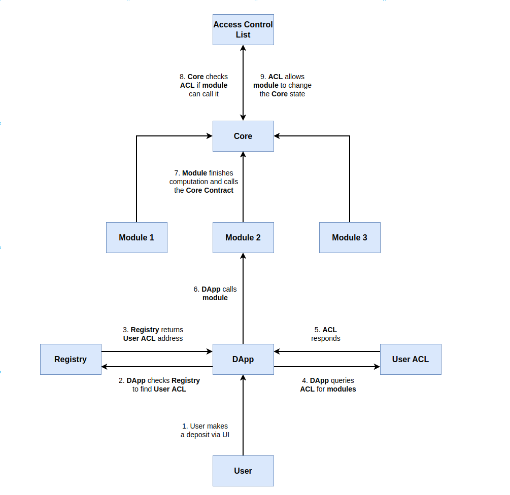

# Modular-Contracts

Architecture for writing modular contracts in Sway.

## Overview

The contracts in the repository present one, minimal and simple, configuration for writing modular contracts.

The idea stems from [EIP-2535 Diamond Standard](https://eips.ethereum.org/EIPS/eip-2535) where each contract contains minimal code for some computation. These modules can be daisy chained together to create a custom workflow.

The example in the repository consists of a module calling into a vault to perform a deposit. This is done by abstracting away the deposit computation from the vault into a module and using the vault as a settlement contract.

The code ought to be adjusted for implementation in production because we present a simple interface for querying storage which isn't ideal for applications.

Lastly, unless the user can run their own user interface (UI) this system will be liable for exploit similar to any other contract which relies on a trustworthy UI that cannot be exploited. This is a limitation outside the scope of this system.

## Components

### Core Contract

The core contract is a contract that is stripped of its functionality and what remains is the ability to settle (change the state) in the contract. The contract itself acts as an API to storage.

Abstracting away the logic into [Modules](#Modules) allows the developer to upgrade a small piece of code without having to redeploy the entire contract.

In this example it's a vault that enables a module to deposit funds on behalf of a user.

### Access Control List (ACL)

The access control list determines the interactions between contracts.

#### Developer

The developer controls which modules are able to interact with their [Core Contract](#core-contract), specifically which module is able to call which function.

#### User

The user controls which modules they allow computation to be performed on their behalf. This enables a developer to create new modules at will without sliding in a new module without the users knowledge. The user has to opt into which module, or version of a module, they interact with.

The limitation being that the developer may disable all modules the user has chosen effectively forcing them to upgrade to continue to use their [Core Contract](#core-contract).

### Registry

The registry is used by the DApp to keep track of the users and their [ACL](#user). Through the registry the DApp can discover the ACL and query it to see which modules the user has made available.

### Modules

Modules contain the code that would usually be in a monolithic contract. A module is a contract that acts as a glorified function within the [Core Contract](#core-contract). It requires a little more configuration, such as the ability to know which contract to call.

The modules can be contract specific through the use of an ABI or act as a proxy to all compatible contracts via the user of Sway's low level call from the standard library.

## Diagram

